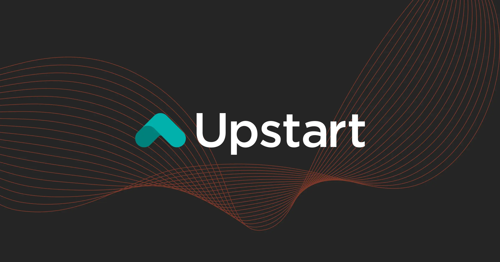
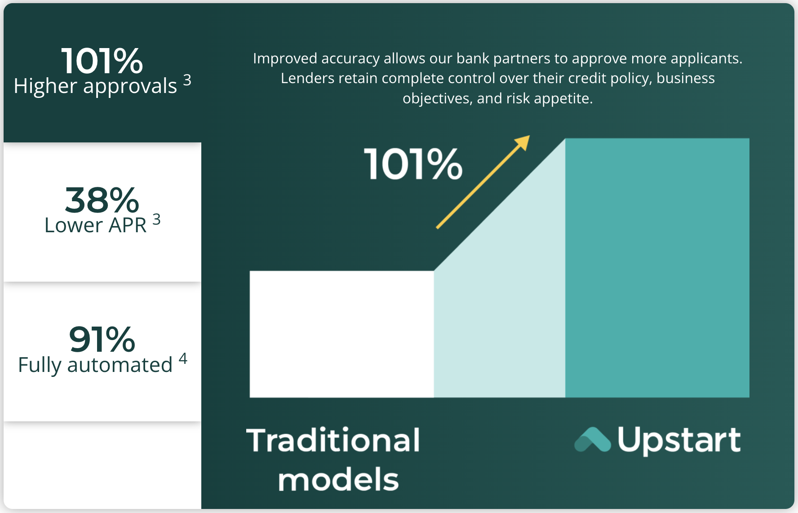
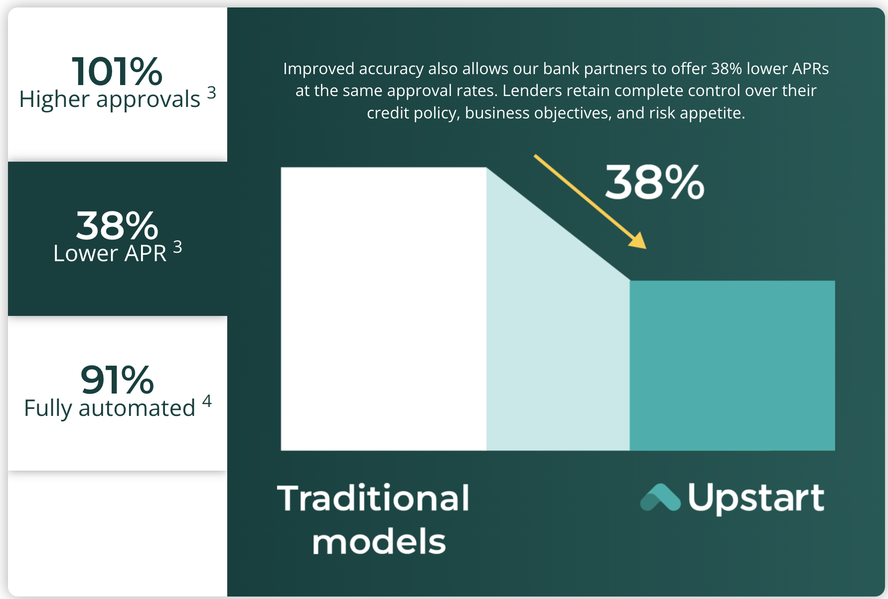
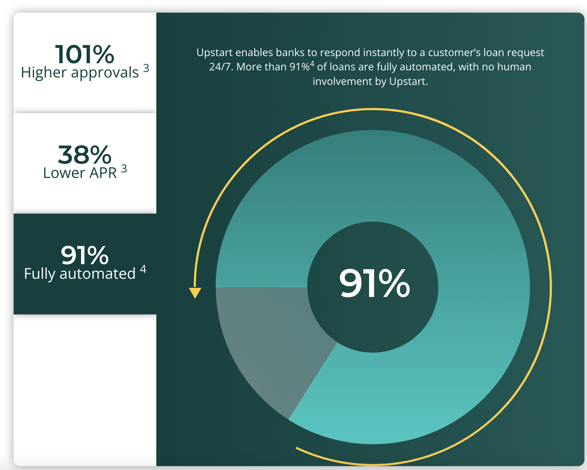
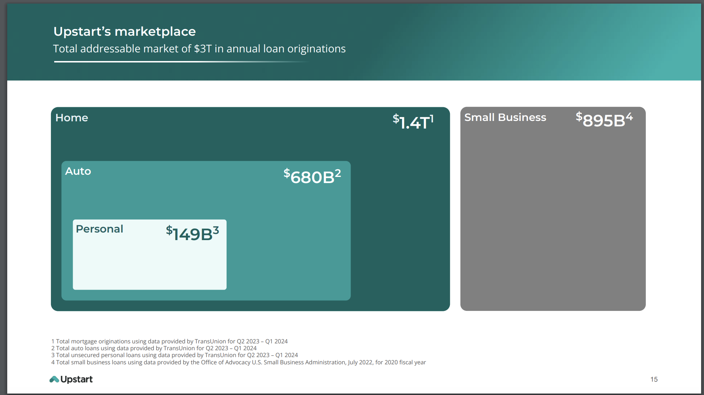
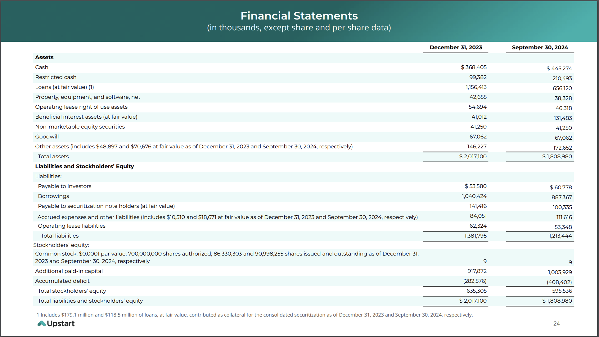
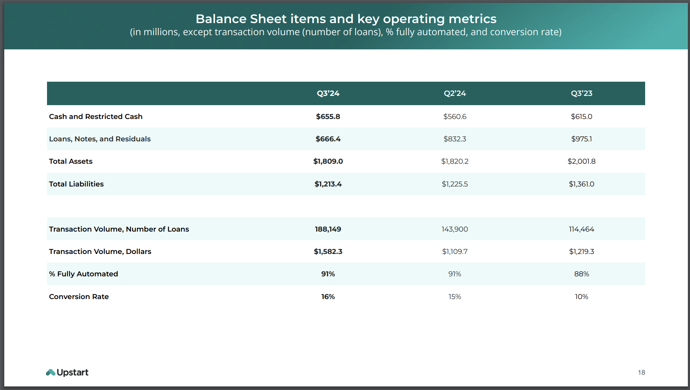
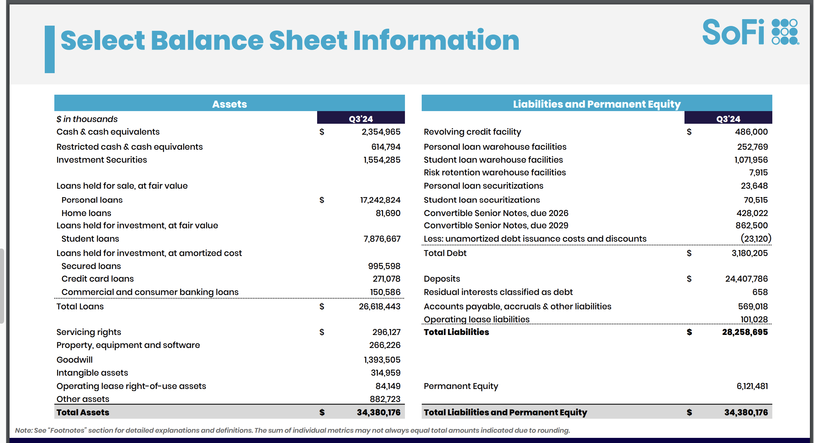

    

## Overview and Origin
### The Company and the Brand
The traditional lending method to determine a borrower's financial strength to repay their loan is broken, unjust, and at times unfair. Specifically customer of lower income, people of color, and migrants are vastly impacted by these methods which financial institutes leverage to access customer likely not to defult on their loan. 

Upstart, founded in 2012 by three ex-Google, Anna Counselman, Dave Girouard, and Paul Gu emabarked on the journey to disrupt and challenge the norm of accessing customer financial background and their ability to make repayment on their loans using FICO score. 
        
Upstart is primarily funded through a partnership with banks and credit unions, where these institutions provide the capital to fund loans originated on the Upstart platform; for lower-risk borrowers, partner banks often hold these loans on their balance sheet, while for higher-risk borrowers, the loans are typically sold to institutional investors after origination by the bank partners; essentially, Upstart acts as a marketplace connecting borrowers with lenders, generating revenue through fees on the loans facilitated through their platform

## Business Activities
### Dilemma and The Solution
Traditional lending models quantify the risk of a portfolio of loans based on criteria such as average credit score, income, and debt ratio. These estimates are commonly done at the portfolio level, rather than at the loan level. This approach can produce a useful, but imprecise, prediction of the loss rate for a portfolio.

More modern risk models quantify the unique risks of default and prepayment for each loan in the portfolio.

We connect millions of consumers to 100+ banks and credit unions who leverage Upstart’s artificial intelligence models and cloud applications to deliver superior credit products. Our platform includes personal loans, automotive retail and refinance loans, home equity lines of credit, and small dollar “relief” loans. Focusing on assessing creditworthiness beyond traditional credit scores.

### Target Market
The target market of Upstart is as follows, however lets point out that at the time of the case, the market share that Upstart commands in the Lending Partners landdscape was unknown
1. Personal Loan Borrowers - market size of about $300B
2. Lending Partners - Banks, Credit Union etc

### Core Business Model vs Competitors
It starts by vastly expanding the information used to inform a credit decision. Our sophisticated machine learning algorithms tease out relationships between more than 1,600 variables2. Trained on more than 77 million repayment events, our AI system learns and improves on its own.

With an average of 80,9781 new repayments due each business day across all our lending partners, our models optimize in response to daily loan-level repayment and delinquency data.

As a result, our proprietary and patented loan-month model can predict the likelihood of default or prepayment for each month of a loan term for every applicant.

### Product and Services
|Product       |Product Description |
|:------------:|        :-----:     |
|AI Lending Marketplace      |A platform that connects consumers with banks and credit unions using AI models to offer credit products like personal loans, auto loans, and home equity lines of credit.  |
|Personal Loans        | Loans provided to individuals for personal use, facilitated through Upstart's AI-driven platform.  |
|Automotive Retail and Refinance Loans    |Loans for purchasing or refinancing vehicles, offered through Upstart's AI platform.  | 
|Home Equity Lines of Credit|Credit lines secured by the borrower's home equity, available through Upstart's AI platform.|
|Small Dollar 'Relief' Loans|Short-term loans for small amounts, designed to provide financial relief, available through Upstart's platform.|
|Upstart Macro Index (UMI)|A tool that helps lending partners understand the impact of macroeconomic conditions on credit performance.|

### Technology Stack         
The Upstart Macro Index (UMI) estimates the impact of the macroeconomy on credit losses for Upstart-powered unsecured personal loans. UMI is expressed as a multiple of defaults relative to a static baseline due to macroeconomic changes. For example, a UMI of 1.25 for a given month suggests that the macro caused default rates to be 25% higher than the long-run average.

Additinal technology stacks leveraged at Upstart are as follows
1. Programming Languages:

        Python: Likely used for machine learning models, data analytics, and backend development.

        Java or Scala: Common for high-performance backend services and data pipelines.

        JavaScript/TypeScript: Likely used for frontend development with frameworks like React.

2. Machine Learning and AI:

        TensorFlow or PyTorch: For building, training, and deploying ML models.

        Scikit-learn: For traditional ML algorithms and feature engineering.

        NumPy, Pandas, and Matplotlib/Seaborn: For data manipulation and visualization.

        AWS SageMaker or custom ML pipelines: For managing and deploying ML models.

3. Backend Services:
        
        Node.js: Possibly for API services.
        
        Spring Boot (Java): A common choice for enterprise-grade backend systems.
        
        GraphQL or REST APIs: To enable communication between services.

4. Databases:

        PostgreSQL or MySQL: For transactional data.
        
        MongoDB: For storing unstructured data.
        
        Redis: For caching to improve performance.
        
        Data Lakes: Likely using Amazon S3 for storing massive amounts of raw data.

5. Cloud Infrastructure:

        AWS (Amazon Web Services): Likely the backbone for hosting and infrastructure.
        
        Google Cloud Platform (GCP): Could also be used for ML tools and storage.
        
        Docker and Kubernetes: For containerization and orchestration.

6. DevOps and Monitoring:

        GitLab/GitHub: For version control and CI/CD pipelines.

        Jenkins or CircleCI: For continuous integration and deployment.
        
        Prometheus and Grafana: For monitoring and alerting.
        
        Datadog or New Relic: For application performance monitoring.

7. Frontend:
       
        React or Vue.js: Likely frameworks for creating dynamic user interfaces.
       
        CSS Frameworks: Tailwind CSS or Bootstrap for styling.

        Webpack or Vite: For module bundling.

8. Security:

        Okta or Auth0: For user authentication and identity management.
        
        TLS/SSL: To secure communications.
        
        Encryption: Likely AES for securing sensitive data.

9. Data Engineering:
        
        Apache Kafka: For real-time data streaming.
        
        Apache Spark: For big data processing.
        
        ETL Pipelines: Custom or tool-based (e.g., Apache NiFi).

10. Analytics:

        Tableau or Power BI: For business intelligence and data visualization.
        
        Snowflake: For scalable data warehousing.

## Landscape
### Financial Service: Innovation and Trends
Measurable innovations trending within Financial Technology(FinTech) and Financial Services sector are but not limited to seamless automated loan approval process clients using AI based tools and technology.
### Competitors
* SoFI
* Affirm
* Prosper
* LendingClub
* ZestAI
* Credit Karma

## Results
### Impact and Differentiator
UMI is enabled by Upstart’s unique risk models that estimate likelihoods of default and prepayment for each month of every Upstart-powered loan. We refer to this as our patented loan-month model. This unique risk model allows us to more accurately separate applicant risk from macro risk—and to measure the macro risk more rapidly.

#### More accurate, efficient, and inclusive lending

        As depicted in exhibit 1, with Upstart AI, lenders can approve more applicants at lower rates across races, ages, and genders, while simultaneously delivering the exceptional digital-first experience customers demand.

#### Exhibit 1: Result and Impact

    

    

    

### Operating Metrics
We review a number of operating metrics, including transaction volume, dollars; transaction volume, number of loans; conversion rate; and percentage of loans fully
automated, to evaluate our business, measure our performance, identify trends affecting our business, formulate business plans, and make strategic decisions.
We define Transaction Volume, Dollars as the total principal of loan originations (or committed amounts for HELOCs) facilitated on our marketplace during the periods
presented. We define Transaction Volume, Number of Loans as the number of loan originations (or commitments issued for HELOCs) facilitated on our marketplace
during the periods presented. We believe these metrics are good proxies for our overall scale and reach as a platform.
We define Conversion Rate as the Transaction Volume, Number of Loans in a period divided by the number of rate inquiries received that we estimate to be legitimate,
which we record when a borrower requests a loan offer on our platform. We track this metric to understand the impact of improvements to the efficiency of our
borrower funnel on our overall growth.
We define Percentage of Loans Fully Automated as the total number of loans in a given period originated end-to-end (from initial rate request to final funding for
personal loans and small dollar loans and from initial rate request to signing of the loan agreement for auto loans) with no human involvement required by the
Company divided by the Transaction Volume, Number of Loans in the same period.

#### Exhibit 2: Upstart Market Place v Competitors

#### Exhibit 3: SoFI Direct Competitor

## Recommendations

Looking closely at Upstart financials, opperating cost is on the higher side. Upstart should look at different cost avoidance strategies to enable them to operate more efficiently. For instance on their benefits page, company provides catering, quarterly offsite events, and among other few perks that directly impacts their buttom line. Considering they are still a startup company, continues operation under these circumstances, could be deterimental.

I will recommend Upstart to expand into crypto services as it is clearly obvious that market trending towards that space. With the recent 2024 United States Election results, there is a high chances Crypto currency becoming the centerilized financial system of the world hence Upstart providing a system as service(SaaS) platform for their customer will contribute greatly to their buttomline at a future state.

## Sources
* [Upstart](https://www.upstart.com/our-story)
* [chatGPT Prompts](https://chatgpt.com/)
* [cloudzero](https://www.cloudzero.com/customers/upstart/)